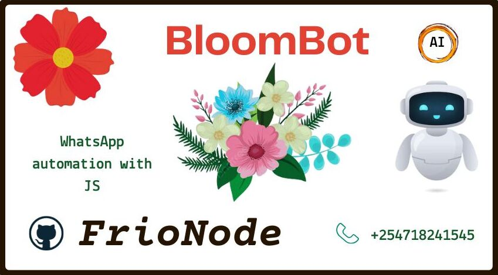

<h1 align="center" style="color:#6b21a8">🌼 BloomBot (Multi-Device) by FrioNode™</h1>

 

  
  
  
  
  

---

  

## 🌟 Welcome to the Realm of BloomBot

> _"Code is temporary, but magic is forever."_

**BloomBot** is not just a WhatsApp bot — it's a **whimsical companion**, a **guardian of group harmony**, and a **multi-tool spellcaster** with over **400+ commands** designed to entertain, moderate, and amaze.

🌌 Whether you're hosting a community or leading a rebellion in the shadows of your digital kingdom, BloomBot is your trusted sidekick. 🌿

---

## 🚀 Deploying the Magic

Conjure your own instance of BloomBot with a single click, thanks to the **Railway** deployment crystal:

  
🔗 [Template URL](https://railway.app/template/rwLjVm?referralCode=xxxxx)

---

## 🧙‍♂️ What Can BloomBot Do?

BloomBot blends code and creativity to offer an arcane suite of features:

| Feature           | Description                                                                                                         |
|-------------------|---------------------------------------------------------------------------------------------------------------------|
| 🔮 **Automation** | Automate repetitive tasks like a background spell — fast, silent, and reliable.                                     |
| 🌟 **Moderation** | Keep order with mute, ban, and filter spells that ward off chaos.                                                   |
| 🎵 **Music**      | Bring harmony to your group with audio magic — summon tracks with ease.                                             |
| 🎮 **Games**      | Engage your community with mini-games, trivia, and bonding magic.                                                   |
| 💡 **400+ Spells**| Explore an expansive library of commands. Fun, useful, weird — you name it, we’ve probably enchanted it.             |

---

## ⚠️ Use With Wisdom

> With great magic comes great responsibility...

BloomBot is **not affiliated with WhatsApp**. It’s your duty, noble adventurer, to use it **responsibly** and **avoid dark arts** like spamming.  
If you get banned by the Kingdom of Meta, no Phoenix Down can save you.

⚔️ Modified forks or tampered plugins? Proceed at your own peril — the dev guild only supports the original spellbook.

---

## 📚 Documentation of the Arcane

📖 Ready to become a master spellcaster? BloomBot’s knowledge grimoire is open to all:

**🧾 [Read the Docs](https://bit.ly/bloombot)** — Learn the syntax of spells, explore the magic circle, and awaken the true potential of your WhatsApp dominion.

---

<h2 align="center">💌 Seek Guidance from the Mystical Realm</h2>

If you find yourself in need of help, or wish to connect with the BloomBot wizards, here are your portals:

  
  
  
  

---

## 👤 About the Creator

Crafted with care by **Benson** — known across all scrolls and signals as **[@FrioNode](https://github.com/FrioNode)**.  
📡 Reach me on all networks using the handle `@FrioNode`.

---

> 🌀 *“The code is open, the journey is yours. May your chats be merry, your commands strong, and your logs ever error-free.”*  
> — The FrioNode Guild

---